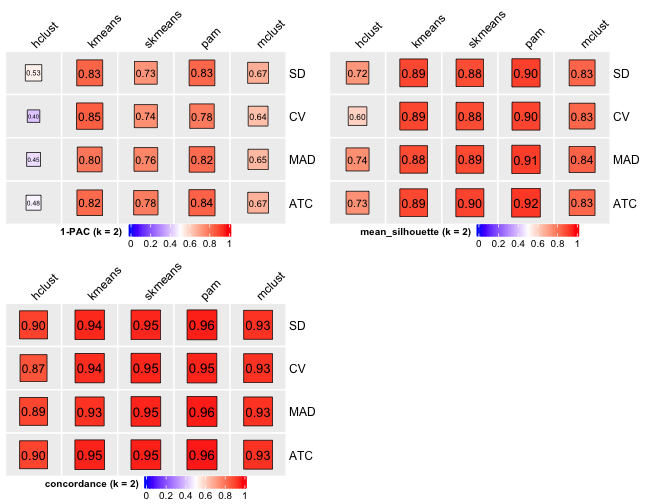
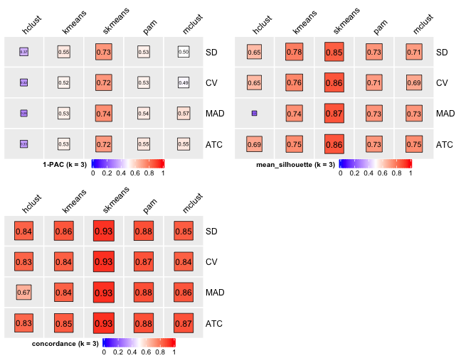
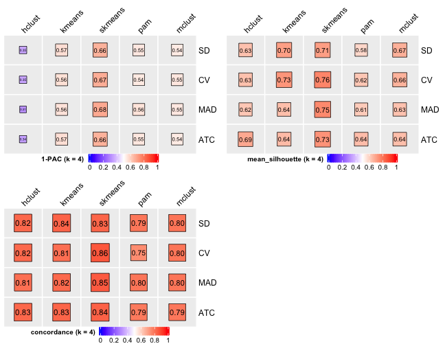
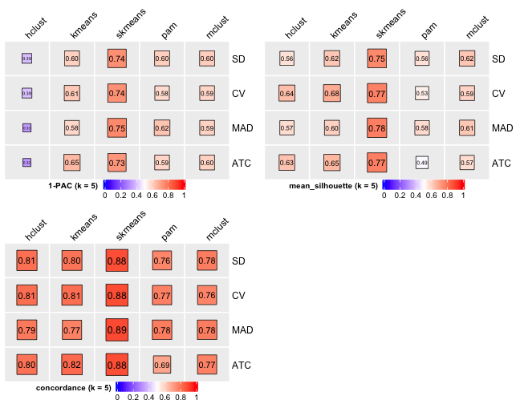
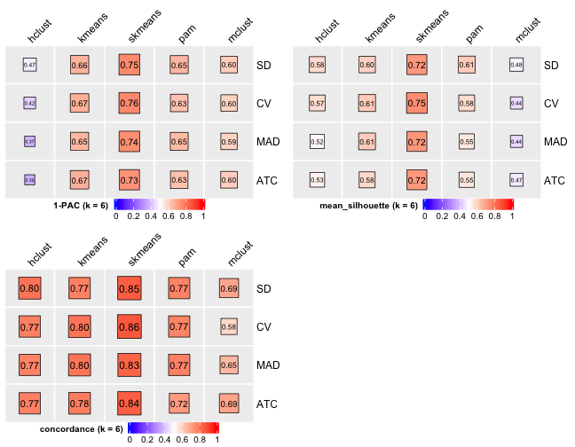
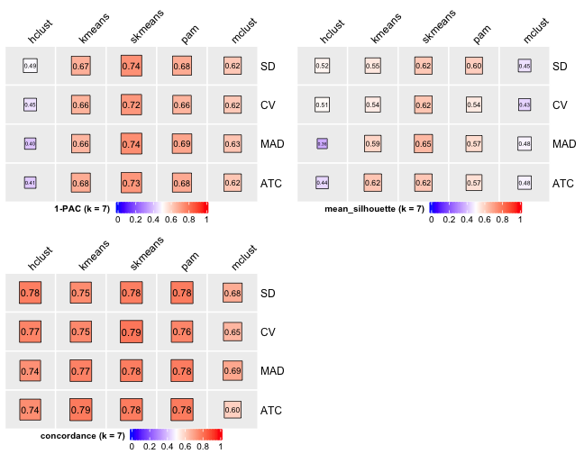
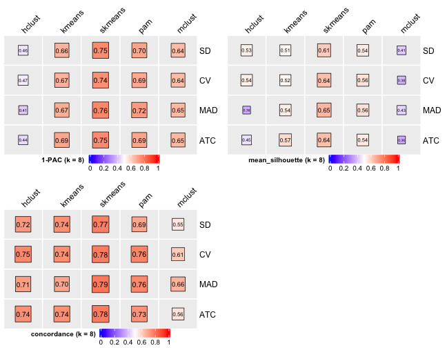
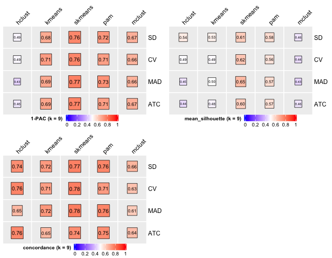
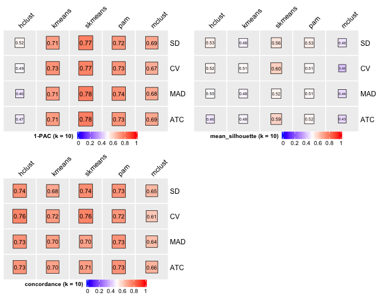

```{r setup-04, include=FALSE}
library(knitr)
library(rmdformats)
## Global options
options(max.print = "75")
opts_chunk$set(
  echo = FALSE,
  cache = FALSE,
  prompt = FALSE,
  tidy = "styler",
  comment = NA,
  dpi = 300,
  message = FALSE,
  warning = FALSE,
  echo = TRUE
)
opts_knit$set(width = 75)
Sys.setenv("LANGUAGE" = "EN")
```

```{r include=FALSE}
ReTidying = FALSE
```

In this part, we would like to cluster all tumors based on CN signatures and use the clusters to explore Pan-Cancer heterogeneity.

## Data integration

Many raw data have been processed by tools (or collected) and cleaned. This part I mainly describe how to combine them to construct the integrated dataset.

> If you care about the data (source) shown below, please check the last section of **PART 0**.

```{r eval=ReTidying}
library(pacman)
p_load(
  tidyverse,
  data.table,
  sigminer,
  IDConverter
)
```

Load pre-processed data.

```{r eval=ReTidying}
pcawg_cn_obj <- readRDS("../data/pcawg_cn_obj.rds")
pcawg_cn_sig <- readRDS("../data/pcawg_cn_sigs_CN176_signature.rds")
pcawg_samp_info_sp <- readRDS("../data/pcawg_samp_info_sp.rds")
samp_summary <- pcawg_cn_obj@summary.per.sample
samp_summary$n_loh <- NULL
```


Check if all samples are recorded.

```{r eval=ReTidying}
all(pcawg_cn_obj@summary.per.sample$sample %in% pcawg_samp_info_sp$pcawg_specimen_histology_August2016_v9$icgc_specimen_id)
```

```{r eval=ReTidying}
pcawg_samp_info_sp <- lapply(pcawg_samp_info_sp, function(x) {
  colnames(x)[1] <- "sample"
  x
})
pcawg_samp_info <- purrr::reduce(pcawg_samp_info_sp, dplyr::full_join, by = "sample")
pcawg_samp_info <- pcawg_samp_info %>% dplyr::filter(sample %in% pcawg_cn_obj@summary.per.sample$sample)

rm(pcawg_samp_info_sp)
```

Refer to @pcawgmutationalsignaturesworkinggroupRepertoireMutationalSignatures2020, some cancer types with small sample size should be combined.

```{r eval=ReTidying}
table(pcawg_samp_info$histology_abbreviation)
```

```{r eval=ReTidying}
pcawg_samp_info <- pcawg_samp_info %>% 
  mutate(
    cancer_type = case_when(
      startsWith(histology_abbreviation, "Breast") ~ "Breast",
      startsWith(histology_abbreviation, "Biliary-AdenoCA") ~ "Biliary-AdenoCA",
      histology_abbreviation %in% c("Bone-Epith", "Bone-Benign") ~ "Bone-Other",
      startsWith(histology_abbreviation, "Cervix") ~ "Cervix",
      histology_abbreviation %in% c("Myeloid-AML, Myeloid-MDS", "Myeloid-AML, Myeloid-MPN", "Myeloid-MDS", "Myeloid-MPN") ~ "Myeloid-MDS/MPN",
      TRUE ~ histology_abbreviation
    )
  )
```

Select important features.

```{r eval=ReTidying}
pcawg_samp_info <- pcawg_samp_info %>% 
  dplyr::select(c("sample", "_PATIENT", "donor_sex", "donor_age_at_diagnosis",
                      "donor_survival_time", "donor_vital_status", "first_therapy_type",
                      "tobacco_smoking_history_indicator", "alcohol_history",
                      "dcc_project_code", "dcc_specimen_type",
                      "histology_abbreviation", "cancer_type",
                      "tumour_stage",
                      "level_of_cellularity"))
colnames(pcawg_samp_info)[2] <- "donor_id"

# Remove duplicated samples
pcawg_samp_info <- pcawg_samp_info[!duplicated(pcawg_samp_info$sample), ]
```

Get signature activities.

```{r eval=ReTidying}
pcawg_activity <- readRDS("../data/pcawg_cn_sigs_CN176_activity.rds")

expo_abs <- pcawg_activity$absolute[, lapply(.SD, function(x) if (is.numeric(x)) round(x, digits = 3) else x)]
colnames(expo_abs) <- c("sample", paste0("Abs_", colnames(expo_abs)[-1]))


expo_rel <- pcawg_activity$relative[, lapply(.SD, function(x) if (is.numeric(x)) round(x, digits = 3) else x)]
colnames(expo_rel) <- c("sample", paste0("Rel_", colnames(expo_rel)[-1]))

pcawg_activity2 <- dplyr::left_join(expo_abs, expo_rel, by = "sample")
pcawg_activity2 <- dplyr::left_join(pcawg_activity2, pcawg_activity$similarity, by = "sample")

pcawg_activity2$keep <- pcawg_activity2$similarity > 0.75
pcawg_activity <- pcawg_activity2

rm(pcawg_activity2, expo_abs, expo_rel)
```

Read tumor purity & ploidy & WGD status.

```{r eval=ReTidying}
dt_pp <- fread("../data/PCAWG/consensus.20170217.purity.ploidy_sp")
dt_pp <- dt_pp[, c("samplename", "purity", "ploidy", "wgd_status")]
colnames(dt_pp)[1] <- "sample" 
```

Calculate fusion events in all samples.

```{r eval=ReTidying}
fusion <- fread("../data/PCAWG/pcawg3_fusions_PKU_EBI.gene_centric.sp.xena")
fusion <- as.matrix(fusion[, -1])
fusion <- apply(fusion, 2, sum)
fusion <- dplyr::tibble(
  sample = names(fusion),
  n_fusion = as.numeric(fusion)
)
```

Load HRD status in all samples.

```{r eval=ReTidying}
HRD <- readRDS("../data/PCAWG/pcawg_CHORD.rds")
HRD <- HRD %>% 
  dplyr::select(icgc_specimen_id, is_hrd, genotype_monoall) %>% 
  set_names(c("sample", "hrd_status", "hrd_genotype")) %>% 
  unique()
```

```{r, include=FALSE, eval=FALSE}
#HRD <- readRDS("../data/PCAWG/PCAWG_HRDindex.RDS")
# HRD <- dplyr::tibble(
#   sample = names(HRD),
#   HRDindex = as.numeric(HRD)
# )
```


Read LOH data.

```{r eval=ReTidying}
LOH <- readRDS("../data/pcawg_loh.rds")
```


Read Chromothripsis data and clean it.

```{r eval=ReTidying}
# http://compbio.med.harvard.edu/chromothripsis/
chromothripsis <- fread("../data/PCAWG/PCAWG-ShatterSeek.txt.gz")
chromothripsis <- chromothripsis[, c("icgc_donor_id", "type_chromothripsis", "chromo_label")]

# Check label
table(chromothripsis$chromo_label)
any(is.na(chromothripsis$chromo_label))

# Summarize
chromothripsis_summary <- chromothripsis[
  , .(n_chromo = sum(chromo_label != "No"),
      chromo_type = paste0(na.omit(type_chromothripsis), collapse = "/")), by = icgc_donor_id]

chromothripsis_summary <- merge(chromothripsis_summary, pcawg_full[, c("icgc_donor_id", "icgc_specimen_id")],
      by = "icgc_donor_id") %>% unique()
chromothripsis_summary$icgc_donor_id <- NULL
colnames(chromothripsis_summary)[3] <- "sample"
rm(chromothripsis)
```

Read AmpliconArchitect results.

```{r eval=ReTidying}
aa1 <- readxl::read_excel("../data/PCAWG/ecDNA.xlsx", skip = 1)
aa2 <- readxl::read_excel("../data/PCAWG/ecDNA.xlsx", sheet = 3)

table(aa1$amplicon_classification)
table(aa2$sample_classification)
all(aa1$sample_barcode %in% aa2$sample_barcode)

aa_summary <- aa1 %>% 
  dplyr::group_by(sample_barcode) %>% 
  dplyr::summarise(
    n_amplicon_BFB = sum(amplicon_classification == "BFB", na.rm = TRUE),
    n_amplicon_ecDNA = sum(amplicon_classification == "Circular", na.rm = TRUE),
    n_amplicon_HR = sum(amplicon_classification == "Heavily-rearranged", na.rm = TRUE),
    n_amplicon_Linear = sum(amplicon_classification == "Linear", na.rm = TRUE),
    .groups = "drop"
  )

data.table::setDT(aa_summary)

custom_dt <- IDConverter::pcawg_simple[, c("submitted_specimen_id", "icgc_specimen_id")]
custom_dt <- custom_dt[startsWith(submitted_specimen_id, "TCGA")]
custom_dt[, submitted_specimen_id := substr(submitted_specimen_id, 1, 15)]

aa_summary[
  , sample := ifelse(
    startsWith(sample_barcode, "SA"),
    convert_pcawg(sample_barcode, from = "icgc_sample_id", to = "icgc_specimen_id"),
    convert_custom(sample_barcode, from = "submitted_specimen_id", to = "icgc_specimen_id", dt = custom_dt))]

## Filter out samples not in PCAWG
aa_summary <- aa_summary[!is.na(sample)][, sample_barcode := NULL]

rm(aa1, aa2, custom_dt)
```

Read TelomereHunter results.

```{r eval=ReTidying, warning=FALSE}
TC <- readxl::read_excel("../data/PCAWG/TelomereContent.xlsx")
TC <- TC %>% dplyr::select(c("icgc_specimen_id", "tel_content_log2"))
colnames(TC)[1] <- "sample"
data.table::setDT(TC)
```

```{r eval=ReTidying}
apobec <- read_tsv("../data/PCAWG/MAF_Aug31_2016_sorted_A3A_A3B_comparePlus.txt", col_types = cols())
apobec <- apobec %>% 
  dplyr::select(c(1, 5)) %>% 
  data.table::as.data.table() %>% 
  setNames(c("sample", "APOBEC_mutations"))
```


Combine and save result combined data.

```{r eval=ReTidying}
pcawg_samp_info <- purrr::reduce(list(pcawg_samp_info,
                                      pcawg_activity,
                                      samp_summary,
                                      dt_pp,
                                      fusion,
                                      HRD,
                                      LOH,
                                      chromothripsis_summary,
                                      aa_summary,
                                      TC,
                                      apobec), 
                                 dplyr::left_join, by = "sample")

saveRDS(pcawg_samp_info, file = "../data/pcawg_sample_tidy_info.rds")

## Remove all objects
rm(list = ls())
```


## Clustering with signature activity

Here, we use recent consensus clustering toolkit [cola](https://github.com/jokergoo/cola).

We take 2 steps to obtain a robust clustering result:

1. We sort all samples by their total signature activities and randomly select `500` samples for running multiple methods provided by `cola` at the same time, then pick up the optimal method combination.
2. We run clustering for all samples by the method combination above and check the cola report to determine the suitable cluster number.

### Step 1: select suitable method combination

There are 2 key arguments in `cola` clustering function:

1. `top_value_method`: used to extract rows (i.e. signatures here) with top values.
2. `partition_method`: used to select partition method.

We try all combinations with randomly selected `500` samples to explore the suitable setting.

```{r, eval=FALSE}
library(cola)
library(tidyverse)

act <- readRDS("../data/pcawg_cn_sigs_CN176_activity.rds")

df <- purrr::reduce(
  list(
    act$absolute,
    act$similarity
  ),
  dplyr::left_join,
  by = "sample"
)

mat <- df %>%
  filter(similarity > 0.75) %>%
  select(sample, starts_with("CNS")) %>%
  column_to_rownames("sample") %>%
  t()
mat_adj <- adjust_matrix(mat)
#1 rows have been removed with too low variance (sd < 0.05 quantile)

rownames(mat_adj)

# Select suitable parameters ----------------------------------------------

ds <- colSums(mat_adj)
boxplot(ds)

set.seed(123)
select_samps <- sample(names(sort(ds)), 500)

boxplot(ds[select_samps])

rl_samp <- run_all_consensus_partition_methods(mat_adj[, select_samps], top_n = 13, mc.cores = 8, max_k = 10)
cola_report(rl_samp, output_dir = "../output/cola_report/pcawg_sigs_500_sampls", mc.cores = 8)

rm(rl_samp)
```

The `cola` output report is very big and isn't suitable to show, here I only include key figures to determine the parameter setting.

```{r out.width="100%"}
# Cluster number 2

# Cluster number 3

# Cluster number 4

# Cluster number 5

# Cluster number 6

# Cluster number 7

# Cluster number 8

# Cluster number 9

# Cluster number 10

```

### Step 2: select suitable cluster number

From figures above we do clearly see that the `skmeans` partition method fits our data and any `top_value_method` is okay (because all signatures are used). Finally, we choose combine `skmeans` (partition method) and `ATC` (top value method introduced firstly by `cola`) to run clustering for all samples.

```{r eval=FALSE}
final <- run_all_consensus_partition_methods(
  mat_adj,
  top_value_method = "ATC",
  partition_method = "skmeans",
  top_n = 13, mc.cores = 8, max_k = 10
)
cola_report(final, output_dir = "../output/cola_report/pcawg_sigs_all_sampls", mc.cores = 8)

saveRDS(final, file = "../data/pcawg_cola_result.rds")
```

The report can be viewed at [here](./pcawg_sigs_all_sampls/cola_report.html).

Next, we will load the data and visualize to select suitable cluster number.

```{r message=FALSE}
library(cola)
library(ComplexHeatmap)
library(tidyverse)

cluster_res <- readRDS("../data/pcawg_cola_result.rds")
cluster_res <- cluster_res["ATC", "skmeans"]
cluster_res
```

Show different statistics along with different cluster number `k`, which helps to determine the "best k".

```{r}
select_partition_number(cluster_res)
```

There are many details about all statistical measures shown above at [cola vignette](http://bioconductor.org/packages/devel/bioc/vignettes/cola/inst/doc/cola.html#toc_13). The best k `2` is suggested by `cola` package due to its better statistical measures. However, in this practice, I think `5` is more suitable. 

I have the following reasons:

1. Measure `1 - PAC` reaches convergence at `k = 5`.
2. Measure `Silhouette` reaches local optimum at `k = 5`.
3. Measure `Concordance` reaches local optimum at `k = 5`.


I will draw another plot to show why the two `k`s are suitable.

```{r, fig.width=13}
collect_classes(cluster_res)
```

We can see that the probability constitution of class assignment for subgroups for `k = 6, 7, 8` are similar to `k = 5`.

Draw all plots into one single page.

```{r, eval=FALSE}
pdf(file = "../output/cola_all_plots.pdf", width = 16, height = 10)
collect_plots(cluster_res)
dev.off()
```

Now we get the cluster labels of samples for downstream analysis.

```{r, eval=FALSE}
pcawg_clusters <- get_classes(cluster_res, k = 5)
saveRDS(pcawg_clusters, file = "../data/pcawg_clusters.rds")
```

## Heatmap for clustering and genotype/phenotype features

Load tidy sample info.

```{r}
tidy_info <- readRDS("../data/pcawg_sample_tidy_info.rds")
```

Clean some info.

```{r}
detect_any <- function(x, p) {
  if (length(p) == 1L) {
    y <- stringr::str_detect(x, p)
  } else {
    y <- purrr::map(p, ~stringr::str_detect(x, .))
    y <- purrr::reduce(y, `|`)
  }
  y[is.na(y)] <- FALSE
  y
}

tidy_info <- tidy_info %>% 
  dplyr::mutate(
    # Roughly reassign the staging to TNM stages
    # Basically follow 7th TNM staging version, see plot <https://bkimg.cdn.bcebos.com/pic/a8014c086e061d952019ec8773f40ad162d9ca36?x-bce-process=image/watermark,image_d2F0ZXIvYmFpa2U4MA==,g_7,xp_5,yp_5>
    #
    # Other references:
    # https://www.cancer.org/treatment/understanding-your-diagnosis/staging.html
    # https://www.cancer.gov/publications/dictionaries/cancer-terms/def/abcd-rating
    # https://web.archive.org/web/20081004121942/http://www.oncologychannel.com/prostatecancer/stagingsystems.shtml
    # https://baike.baidu.com/item/TNM%E5%88%86%E6%9C%9F%E7%B3%BB%E7%BB%9F/10700513
    tumour_stage = case_when(
      tumour_stage %in% c("1", "1a", "1b", "A", "I", "IA", "IB", "T1c", "T1N0") | detect_any(tumour_stage, c("T1N0M0", "T1aN0M0", "T1bN0M0", "T2aN0M0")) ~ "I",
      tumour_stage %in% c("2", "2a", "2b", "B", "II", "IIA", "IIB", "T3a", "T3aN0") | detect_any(tumour_stage, c("T2bN0M0", "T3N0M0", "T[^34]N1.*M0")) ~ "II",
      tumour_stage %in% c("3", "3a", "3b", "3c", "C", "III", "IIIA", "IIIB", "IIIC") | detect_any(tumour_stage, c("N[23].*M0", "T3N1.*M0", "T4.*M0")) ~ "III",
      tumour_stage %in% c("4", "IV", "IVA") | detect_any(tumour_stage, "M[^0X]") ~ "IV",
      TRUE ~ "Unknown"
    ),
    first_therapy_type = ifelse(first_therapy_type == "monoclonal antibodies (for liquid tumours)",
                                "other therapy", first_therapy_type)
  )
```

Generate annotation data for plotting.

```{r}
anno_df = tidy_info %>% 
  dplyr::filter(keep) %>% 
  dplyr::select(sample, 
                donor_age_at_diagnosis, n_of_amp, n_of_del, n_of_vchr, cna_burden, purity, ploidy,
                n_LOH, n_fusion, n_chromo, n_amplicon_BFB, n_amplicon_ecDNA, n_amplicon_HR, n_amplicon_Linear,
                tel_content_log2,
                donor_sex, tumour_stage, wgd_status, hrd_status) %>%
  dplyr::mutate_at(
    vars(n_fusion, n_chromo, n_amplicon_BFB, n_amplicon_ecDNA, n_amplicon_HR, n_amplicon_Linear),
    ~ifelse(is.na(.), 0, .)
    ) %>% 
  dplyr::mutate(hrd_status = ifelse(hrd_status, "hrd", "no_hrd")) %>% 
  rename(
    Age = donor_age_at_diagnosis,
    AMPs = n_of_amp,
    DELs = n_of_del,
    Affected_Chrs = n_of_vchr,
    CNA_Burden = cna_burden,
    Purity = purity,
    Ploidy = ploidy,
    LOHs = n_LOH,
    Fusions = n_fusion,
    Chromothripsis = n_chromo,
    BFBs = n_amplicon_BFB,
    ecDNAs = n_amplicon_ecDNA,
    HRs = n_amplicon_HR,
    Linear_Amplicons = n_amplicon_Linear,
    `Telomere_Content(log2)` = tel_content_log2,
    Sex = donor_sex,
    Tumor_Stage = tumour_stage,
    WGD_Status = wgd_status,
    HRD_Status = hrd_status
  ) %>% 
  tibble::column_to_rownames("sample")

saveRDS(anno_df, file = "../data/pcawg_tidy_anno_df.rds")

left_annotation = rowAnnotation(foo = anno_text(paste0("CNS", 1:13)))
```

Show heatmap for clusters based on signature activities.

```{r error=TRUE, fig.width=22, fig.height=10}
get_signatures(cluster_res, k = 5, silhouette_cutoff = 0.2, anno = anno_df,
               left_annotation = left_annotation)
```

Save to file.

```{r eval=FALSE}
pdf(file = "../output/pcawg_cluster_heatmap.pdf", width = 22, height = 10, onefile = FALSE)
get_signatures(cluster_res, k = 5, silhouette_cutoff = 0.2, anno = anno_df, left_annotation = left_annotation)
dev.off()
```

## Exploration of patients' prognosis difference across clusters

### Clean data for survival analysis

```{r}
library(ezcox)
library(tidyverse)

cluster_df <- readRDS("../data/pcawg_clusters.rds") %>%
  as.data.frame() %>%
  tibble::rownames_to_column("sample")

tidy_info <- readRDS("../data/pcawg_sample_tidy_info.rds")

df_os <- tidy_info %>% 
  dplyr::filter(keep) %>% 
  dplyr::select(sample, donor_vital_status, donor_survival_time) %>% 
  purrr::set_names(c("sample", "os", "time")) %>% 
  na.omit() %>% 
  mutate(os = ifelse(os == "deceased", 1, 0),
         time = time / 365) %>% 
  left_join(cluster_df, by = "sample")

colnames(df_os)[4] <- "cluster"
# Use the group with minimal CNV level as reference group
df_os$cluster <- paste0("subgroup", df_os$cluster)
```

Available sample number with OS data:

```{r}
nrow(df_os)
```


### Forest plot

It's pretty easy to visualize the relationship between subgroups and patient's prognosis with forest plot by R package `ezcox` developed by me before.

```{r}
show_forest(df_os, covariates = "cluster", status = "os", add_caption = FALSE, merge_models = TRUE)
```

### K-M plot

We can also check the OS difference with K-M plot.

```{r}
library(survival)
library(survminer)
```

```{r fig.height=6}
sfit <- survfit(Surv(time, os) ~ cluster, data = df_os)
ggsurvplot(sfit,
           pval = TRUE,
           fun = "pct",
           xlab = "Time (in years)",
           #palette = "jco",
           legend.title = ggplot2::element_blank(),
           legend.labs = paste0("subgroup", 1:5),
           break.time.by = 5,
           risk.table = TRUE,
           tables.height = 0.4)
```

The result has similar meaning as forest plot.

## The difference of genotype/phenotype measures across clusters

### Signatures

Load SBS/DBS/ID signature activities generated from PCAWG Nature Study.

```{r message=FALSE}
pcawg_sbs <- read_csv("../data/PCAWG/PCAWG_sigProfiler_SBS_signatures_in_samples.csv")
pcawg_dbs <- read_csv("../data/PCAWG/PCAWG_sigProfiler_DBS_signatures_in_samples.csv")
pcawg_id <- read_csv("../data/PCAWG/PCAWG_SigProfiler_ID_signatures_in_samples.csv")
```

Merge data.

```{r}
df_merged <- purrr::reduce(
  list(
    tidy_info,
    pcawg_sbs[, -c(1, 3)] %>% dplyr::rename(sample = `Sample Names`) %>% 
      # Drop Possible sequencing artefact associated signatures
      dplyr::select(-SBS43, -c(SBS45:SBS60)),
    pcawg_dbs[, -c(1, 3)] %>% dplyr::rename(sample = `Sample Names`),
    pcawg_id[, -c(1, 3)] %>% dplyr::rename(sample = `Sample Names`),
    cluster_df[, 1:2] %>% purrr::set_names(c("sample", "cluster"))
  ),
  dplyr::left_join,
  by = "sample"
) %>% 
  dplyr::filter(!is.na(cluster)) %>% 
  mutate(cluster = paste0("subgroup", cluster))

colnames(df_merged) <- gsub("Abs_", "", colnames(df_merged))
```

#### Enrichment analysis for copy number signatures

```{r}
library(sigminer)
enrich_result_cn <- group_enrichment(
  df_merged,
  grp_vars = "cluster",
  enrich_vars = paste0("CNS", 1:14),
  co_method = "wilcox.test"
)
```

```{r fig.height=5, fig.width=6.5}
enrich_result_cn$enrich_var <- factor(enrich_result_cn$enrich_var, paste0("CNS", 1:14))

p <- show_group_enrichment(
  enrich_result_cn,
  fill_by_p_value = TRUE,
  cut_p_value = TRUE,
  return_list = T
)
p <- p$cluster + labs(x = NULL, y = NULL)
p + coord_flip()
```

#### Enrichment analysis for SBS signatures

```{r}
nm_sbs <- colnames(df_merged)[grepl("SBS", colnames(df_merged))]

enrich_result_sbs <- group_enrichment(
  df_merged,
  grp_vars = "cluster",
  enrich_vars = nm_sbs,
  co_method = "wilcox.test"
)
```

```{r fig.height=9, fig.width=6.5}
enrich_result_sbs$enrich_var <- factor(enrich_result_sbs$enrich_var, nm_sbs)

p <- show_group_enrichment(
  enrich_result_sbs,
  fill_by_p_value = TRUE,
  cut_p_value = TRUE,
  return_list = T
)
p <- p$cluster + labs(x = NULL, y = NULL)
p + coord_flip()
```

#### Enrichment analysis for DBS signatures

```{r}
nm_dbs <- colnames(df_merged)[grepl("DBS", colnames(df_merged))]

enrich_result_dbs <- group_enrichment(
  df_merged,
  grp_vars = "cluster",
  enrich_vars = nm_dbs,
  co_method = "wilcox.test"
)
```

```{r fig.height=5, fig.width=6.5}
enrich_result_dbs$enrich_var <- factor(enrich_result_dbs$enrich_var, nm_dbs)

p <- show_group_enrichment(
  enrich_result_dbs,
  fill_by_p_value = TRUE,
  cut_p_value = TRUE,
  return_list = T
)
p <- p$cluster + labs(x = NULL, y = NULL)
p + coord_flip()
```

#### Enrichment analysis for ID signatures

```{r}
nm_id <- colnames(df_merged)[grepl("^ID[0-9]+", colnames(df_merged))]

enrich_result_id <- group_enrichment(
  df_merged,
  grp_vars = "cluster",
  enrich_vars = nm_id,
  co_method = "wilcox.test"
)
```

```{r fig.height=5.5, fig.width=6.5}
enrich_result_id$enrich_var <- factor(enrich_result_id$enrich_var, nm_id)

p <- show_group_enrichment(
  enrich_result_id,
  fill_by_p_value = TRUE,
  cut_p_value = TRUE,
  return_list = T
)
p <- p$cluster + labs(x = NULL, y = NULL)
p + coord_flip()
```

#### Combined COSMIC signature result

Merge all COSMIC signature results.

```{r}
enrich_result_cosmic <- purrr::reduce(
  list(enrich_result_sbs, enrich_result_dbs, enrich_result_id),
  rbind
)
```

> 移除带 NA 和 Inf 的 signatures 结果，然后绘制一个汇总图，对 signatures 进行聚类，以确定 signature 排序。

#### Word cloud plot for COSMIC signature etiologies

There are so many COSMIC signatures above, it is not easy to summarize the data. Considering all COSMIC signatures are labeled and many of them have been assigned to a specific etiology, here we try to use word cloud plot to summarize the result above.

Load etiologies of COSMIC signatures.

```{r}
cosmic_ets <- purrr::reduce(
  list(
    sigminer::get_sig_db("SBS")$aetiology %>% tibble::rownames_to_column("sig_name"),
    sigminer::get_sig_db("DBS")$aetiology %>% tibble::rownames_to_column("sig_name"),
    sigminer::get_sig_db("ID")$aetiology %>% tibble::rownames_to_column("sig_name")
  ),
  rbind
)
```

```{r}
DT::datatable(cosmic_ets)
```


Generate a `data.frame` for plotting. We only keep significantly and positively enriched signatures in each subgroup.
We note that descriptions for many signatures are too long, thus we use short names.

```{r}
df_ets <- enrich_result_cosmic %>% 
  dplyr::filter(p_value < 0.05 & measure_observed > 1) %>% 
  dplyr::select(grp1, enrich_var) %>% 
  dplyr::left_join(cosmic_ets, by = c("enrich_var"="sig_name")) %>% 
  dplyr::mutate(
    aetiology = dplyr::case_when(
      grepl("APOBEC", aetiology) ~ "APOBEC",
      grepl("Tobacco", aetiology) ~ "Tobacco",
      grepl("clock", aetiology) ~ "Clock",
      grepl("Ultraviolet", aetiology, ignore.case = TRUE) ~ "UV",
      grepl("homologous recombination", aetiology) ~ "HRD",
      grepl("mismatch repair", aetiology) ~ "dMMR",
      grepl("Slippage", aetiology) ~ "Slippage",
      grepl("base excision repair", aetiology) ~ "dBER",
      grepl("NHEJ", aetiology) ~ "NHEJ repair",
      grepl("reactive oxygen", aetiology) ~ "ROS",
      grepl("Polymerase epsilon exonuclease", aetiology) ~ "Polymerase epsilon mutation",
      grepl("eta somatic hypermutation", aetiology) ~ "Polimerase eta hypermutation",
      TRUE ~ aetiology
    )
  ) %>%
  dplyr::count(grp1, aetiology) %>% 
  dplyr::filter(!aetiology %in% c("Unknown", "Possible sequencing artefact"))
```

Plotting.

```{r, fig.width=10}
library(ggwordcloud)

set.seed(42)
ggplot(df_ets, aes(label = aetiology, size = n)) +
  geom_text_wordcloud_area(eccentricity = .35, shape = "square") +
  scale_size_area(max_size = 14) +
  facet_wrap(~grp1) +
  theme_bw()
```


### Other integrated variables

```{r}
df_others <- readRDS("../data/pcawg_tidy_anno_df.rds") %>% 
  tibble::rownames_to_column("sample") %>% 
  dplyr::left_join(
    cluster_df[, 1:2] %>% purrr::set_names(c("sample", "cluster")),
    by = "sample"
  ) %>% 
  dplyr::mutate(
    Tumor_Stage = dplyr::case_when(
      Tumor_Stage == "I" ~ 1,
      Tumor_Stage == "II" ~ 2,
      Tumor_Stage == "III" ~ 3,
      Tumor_Stage == "IV" ~ 4),
    isFemale = Sex == "female",
    isWGD = WGD_Status == "wgd",
    isHRD = HRD_Status == "hrd",
    cluster = paste0("subgroup", cluster)
  ) %>% 
  dplyr::select(-c(Sex, WGD_Status, HRD_Status))
```


```{r}
nm_others <- setdiff(colnames(df_others), c("sample", "cluster"))

enrich_result_others <- group_enrichment(
  df_others,
  grp_vars = "cluster",
  enrich_vars = nm_others,
  co_method = "wilcox.test"
)
```

```{r fig.height=7, fig.width=6.5}
enrich_result_others$enrich_var <- factor(enrich_result_others$enrich_var, nm_others)

p <- show_group_enrichment(
  enrich_result_others,
  fill_by_p_value = TRUE,
  cut_p_value = TRUE,
  return_list = T
)
p <- p$cluster + labs(x = NULL, y = NULL)
p + coord_flip()
```

> The `HR` here represents `Heavily rearrangement`, don't mix it with `HRD` which means `Defective homologous recombination DNA damage repair`.

### Driver genes

We have already observed that there are different mutational processes across different groups. Here we try to go further study if different driver genes activate in different groups.

We obtained coding driver mutations from [UCSC Xena database](https://xena.hiplot.com.cn/datapages/?dataset=pcawg_whitelist_coding_drivers_v1_sep302016.sp.xena&host=https%3A%2F%2Fxena-pcawg.hiplot.com.cn). For known driver genes, we focus on driver gene list obtained from @martinez-jimenezCompendiumMutationalCancer2020.

```{r}
load("../data/pcawg_driver_info.RData")
df_mut <- dplyr::left_join(df_others[, c("sample", "cluster")], 
                           pcawg_driver_number, by = "sample")
colnames(df_mut)[3] <- "Driver_variants"
df_mut$Driver_variants <- ifelse(is.na(df_mut$Driver_variants), 0, df_mut$Driver_variants)

driver_gene_num <- pcawg_driver_gene %>% 
  dplyr::group_by(sample, ROLE) %>% 
  dplyr::summarise(driver_genes = n(), .groups = "drop") %>%
  tidyr::pivot_wider(names_from = "ROLE", values_from = "driver_genes", values_fill = 0)

df_mut <- dplyr::left_join(df_mut, driver_gene_num, by = "sample")
colnames(df_mut)[4:5] <- c("Act_genes", "LoF_genes")
df_mut$Act_genes <- ifelse(is.na(df_mut$Act_genes), 0, df_mut$Act_genes)
df_mut$LoF_genes <- ifelse(is.na(df_mut$LoF_genes), 0, df_mut$LoF_genes)
```

Also merge into info of each driver gene.

```{r}
df_mut2 <- df_mut %>% 
  dplyr::left_join(
    pcawg_driver_gene %>% 
      tidyr::pivot_wider(names_from = "gene", values_from = "ROLE") %>% 
      dplyr::mutate_at(vars(-sample), ~!is.na(.)),
    by = "sample"
  )

## Filter out driver genes with < 10 mutation
gene_sum <- sort(colSums(df_mut2[, -c(1:5)], na.rm = TRUE), decreasing = TRUE)


# 基因按突变数量排序

df_mut2 <- df_mut2 %>% dplyr::select_at(c(colnames(df_mut2)[1:5], names(gene_sum[gene_sum >= 10])))
```

Save the data.

```{r eval=FALSE}
saveRDS(df_mut2, file = "../data/pcawg_mut_df.rds")
```


```{r include=FALSE, eval=FALSE}
library(ggpubr)

ggboxplot(df_mut, x = "cluster", y = "Driver_variants",
          color = "cluster",add = "jitter", palette = "nejm")+
  stat_compare_means(method = "anova")
```


```{r message=FALSE}
nm_mut <- setdiff(colnames(df_mut2), c("sample", "cluster"))

enrich_result_mut <- group_enrichment(
  df_mut2,
  grp_vars = "cluster",
  enrich_vars = nm_mut,
  co_method = "wilcox.test"
)
```


Filter out genes insignificant in all subgroups.

```{r}
keep_df <- enrich_result_mut[ , .(count = sum(p_value < 0.05)), by = enrich_var]
drop_vars <- keep_df[count == 0]$enrich_var

enrich_result_mut2 <- enrich_result_mut[!enrich_var %in% drop_vars]
```

Plotting.

```{r fig.height=10, fig.width=6.5, message=FALSE}
enrich_result_mut2$enrich_var <- factor(enrich_result_mut2$enrich_var, setdiff(nm_mut, drop_vars))

keep_vars <- setdiff(nm_mut, drop_vars)[-c(1:3)]
labels <- c(nm_mut[1:3], paste0(keep_vars, " (", gene_sum[keep_vars], ")"))

p <- show_group_enrichment(
  enrich_result_mut2,
  fill_by_p_value = TRUE,
  cut_p_value = TRUE,
  return_list = T
)
p <- p$cluster + labs(x = NULL, y = NULL)
p + coord_flip() + scale_x_discrete(labels = labels)
```


```{r}
rm(list = ls())
```


```{r include=F, eval=F}
df_genes <- dplyr::left_join(df_others[, c("sample", "cluster")], 
                           pcawg_driver_gene, by = "sample") %>% 
  dplyr::count(cluster, ROLE, gene) %>% na.omit()
```

```{r include=F, eval=F}
library(ggplot2)

ggplot(df_genes, aes(x = gene, y = n, fill = ROLE)) +
  geom_bar(stat = "identity") +
  facet_wrap(~cluster, scales = "free") +
  theme(
    axis.text.x = element_text(size = 4, angle = 90)
  )
```

```{r include=F, eval=F}
df_genes <- dplyr::left_join(df_others[, c("sample", "cluster")], 
                           pcawg_driver_gene, by = "sample") %>% 
  na.omit() %>% 
  tidyr::pivot_wider(names_from = "gene", values_from = "ROLE")
```

